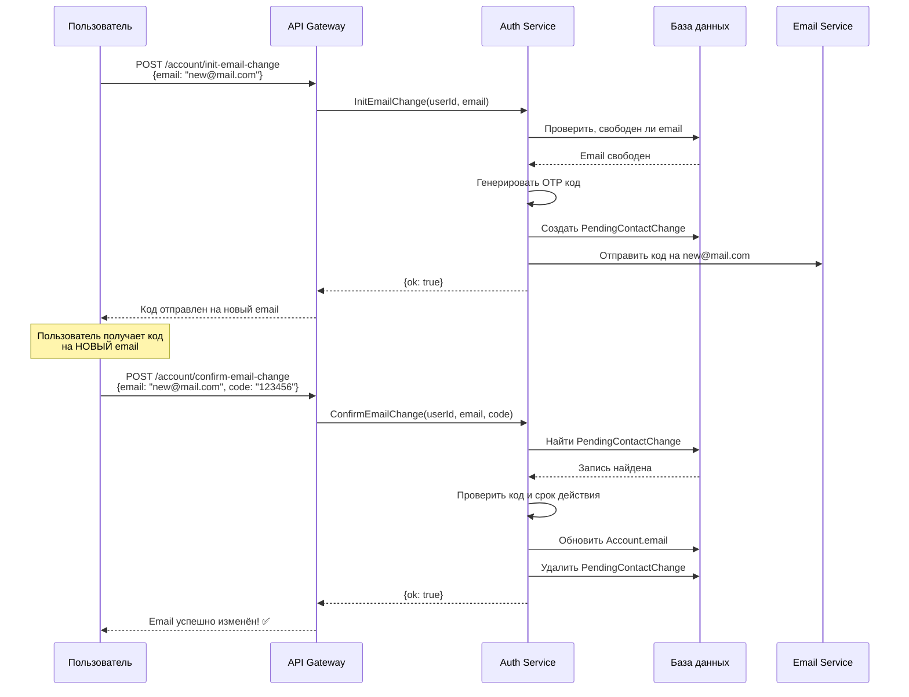

# Таблица PendingContactChange - Назначение и использование

## 📋 Содержание

1. [Для чего нужна таблица](#для-чего-нужна-таблица)
2. [Структура таблицы](#структура-таблицы)
3. [Как это работает](#как-это-работает)
4. [Процесс изменения контактов](#процесс-изменения-контактов)
5. [Примеры использования](#примеры-использования)
6. [Безопасность](#безопасность)

---

## Для чего нужна таблица?

### 🎯 Основное назначение

Таблица `PendingContactChange` используется для **безопасного изменения контактных данных пользователя** (email или телефон) с подтверждением через OTP-код.

### 💡 Зачем это нужно?

Когда пользователь хочет изменить свой email или телефон, мы **не можем сразу изменить** эти данные в таблице `Account`, потому что:

1. **Безопасность** - нужно убедиться, что новый email/телефон действительно принадлежит пользователю
2. **Предотвращение ошибок** - пользователь мог ошибиться при вводе
3. **Защита от взлома** - злоумышленник не сможет просто изменить контакты

### 📊 Как это работает в двух словах:

```
1. Пользователь вводит новый email/телефон
   ↓
2. Система сохраняет это в PendingContactChange (временно)
   ↓
3. Отправляем код подтверждения на НОВЫЙ контакт
   ↓
4. Пользователь вводит код
   ↓
5. Если код правильный → обновляем Account и удаляем PendingContactChange
   Если код неправильный → ничего не меняем
```

---

## Структура таблицы

```prisma
model PendingContactChange {
  id String @id @default(nanoid())

  type String  // "phone" или "email"
  value String // новый номер телефона или email
  codeHash String @map("code_hash") // хеш кода подтверждения
  expiresAt DateTime @map("expires_at") // когда код истекает

  account Account @relation(fields: [accountId], references: [id], onDelete: Cascade)
  accountId String @map("account_id")

  createdAt DateTime @default(now()) @map("created_at")
  updatedAt DateTime @updatedAt @map("updated_at")

  @@map("pending_contact_changes")
}
```

### Поля таблицы:

| Поле        | Тип      | Описание                              | Пример                    |
| ----------- | -------- | ------------------------------------- | ------------------------- |
| `id`        | String   | Уникальный идентификатор записи       | `"V1StGXR8_Z5jdHi6B-myT"` |
| `type`      | String   | Тип контакта: `"phone"` или `"email"` | `"email"`                 |
| `value`     | String   | Новое значение (email или телефон)    | `"new@example.com"`       |
| `codeHash`  | String   | Хеш OTP-кода для проверки             | `"a3f5b2..."`             |
| `expiresAt` | DateTime | Когда истекает срок действия кода     | `2026-01-31 17:00:00`     |
| `accountId` | String   | ID пользователя из таблицы Account    | `"user123"`               |
| `createdAt` | DateTime | Когда создана запись                  | `2026-01-31 16:55:00`     |
| `updatedAt` | DateTime | Когда обновлена запись                | `2026-01-31 16:55:00`     |

---

## Как это работает

### 🔄 Полный процесс изменения email/телефона

#### Шаг 1: Инициализация изменения (InitEmailChange / InitPhoneChange)

**Что происходит:**

```typescript
// 1. Пользователь отправляет запрос на изменение email
const request = {
  userId: "user123",
  email: "newemail@example.com",
};

// 2. Система проверяет, не занят ли этот email
const existingUser = await userRepo.findUserByEmail("newemail@example.com");
if (existingUser) {
  throw new Error("Email уже используется");
}

// 3. Генерируем OTP-код (например, 123456)
const otpCode = generateOTP(); // "123456"

// 4. Хешируем код для безопасного хранения
const codeHash = hash(otpCode); // "a3f5b2c8..."

// 5. Сохраняем в PendingContactChange
await prisma.pendingContactChange.create({
  data: {
    accountId: "user123",
    type: "email",
    value: "newemail@example.com",
    codeHash: codeHash,
    expiresAt: new Date(Date.now() + 5 * 60 * 1000), // 5 минут
  },
});

// 6. Отправляем код на НОВЫЙ email
await sendEmail("newemail@example.com", "Ваш код: 123456");
```

**Что в базе данных:**

```
pending_contact_changes:
┌──────────┬──────────┬────────────────────────┬──────────┬─────────────┬────────────┐
│ id       │ type     │ value                  │ codeHash │ expiresAt   │ accountId  │
├──────────┼──────────┼────────────────────────┼──────────┼─────────────┼────────────┤
│ abc123   │ email    │ newemail@example.com   │ a3f5b2.. │ 17:00:00    │ user123    │
└──────────┴──────────┴────────────────────────┴──────────┴─────────────┴────────────┘

accounts:
┌──────────┬────────────────────┬──────────────┐
│ id       │ email              │ phone        │
├──────────┼────────────────────┼──────────────┤
│ user123  │ old@example.com    │ +1234567890  │  ← Email ещё НЕ изменён!
└──────────┴────────────────────┴──────────────┘
```

---

#### Шаг 2: Подтверждение изменения (ConfirmEmailChange / ConfirmPhoneChange)

**Что происходит:**

```typescript
// 1. Пользователь вводит код
const request = {
  userId: "user123",
  email: "newemail@example.com",
  code: "123456",
};

// 2. Ищем запись в PendingContactChange
const pending = await prisma.pendingContactChange.findFirst({
  where: {
    accountId: "user123",
    type: "email",
    value: "newemail@example.com",
  },
});

if (!pending) {
  throw new Error("Запрос на изменение не найден");
}

// 3. Проверяем, не истёк ли срок
if (pending.expiresAt < new Date()) {
  throw new Error("Код истёк");
}

// 4. Проверяем код
const isValid = verifyHash(request.code, pending.codeHash);
if (!isValid) {
  throw new Error("Неверный код");
}

// 5. ✅ Код правильный! Обновляем Account
await prisma.account.update({
  where: { id: "user123" },
  data: {
    email: "newemail@example.com",
    isEmailVerified: true,
  },
});

// 6. Удаляем запись из PendingContactChange (больше не нужна)
await prisma.pendingContactChange.delete({
  where: { id: pending.id },
});
```

**Что в базе данных после подтверждения:**

```
pending_contact_changes:
┌──────────┬──────────┬────────┬──────────┬───────────┬───────────┐
│ (пусто - запись удалена)                                        │
└──────────┴──────────┴────────┴──────────┴───────────┴───────────┘

accounts:
┌──────────┬────────────────────┬──────────────┬──────────────────┐
│ id       │ email              │ phone        │ isEmailVerified  │
├──────────┼────────────────────┼──────────────┼──────────────────┤
│ user123  │ newemail@example.com│ +1234567890 │ true             │  ← Email изменён! ✅
└──────────┴────────────────────┴──────────────┴──────────────────┘
```

---

## Процесс изменения контактов

### 📧 Изменение Email



### 📱 Изменение Phone (аналогично)

Процесс полностью идентичен, только:

- Вместо `email` используется `phone`
- Код отправляется через SMS, а не email
- Методы: `InitPhoneChange` и `ConfirmPhoneChange`

---

## Примеры использования

### Пример 1: Успешное изменение email

```typescript
// === Шаг 1: Инициализация ===
const initResponse = await accountService.initEmailChange({
  userId: "user123",
  email: "newemail@example.com",
});
// Результат: {ok: true}
// В БД создана запись в pending_contact_changes
// Код отправлен на newemail@example.com

// === Шаг 2: Подтверждение ===
const confirmResponse = await accountService.confirmEmailChange({
  userId: "user123",
  email: "newemail@example.com",
  code: "123456",
});
// Результат: {ok: true}
// Email в Account обновлён
// Запись из pending_contact_changes удалена
```

### Пример 2: Неверный код

```typescript
// Шаг 1: Инициализация (успешно)
await accountService.initEmailChange({
  userId: "user123",
  email: "newemail@example.com",
});

// Шаг 2: Пользователь ввёл неправильный код
await accountService.confirmEmailChange({
  userId: "user123",
  email: "newemail@example.com",
  code: "999999", // ❌ Неправильный код
});
// Ошибка: "Неверный код"
// Email НЕ изменён
// Запись в pending_contact_changes остаётся
```

### Пример 3: Истёкший код

```typescript
// Прошло больше 5 минут после инициализации
await accountService.confirmEmailChange({
  userId: "user123",
  email: "newemail@example.com",
  code: "123456",
});
// Ошибка: "Код истёк"
// Нужно заново вызвать initEmailChange
```

---

## Безопасность

### 🔒 Почему это безопасно?

#### 1. **Хеширование кода**

```typescript
// ❌ НЕПРАВИЛЬНО - хранить код в открытом виде
codeHash: "123456";

// ✅ ПРАВИЛЬНО - хранить хеш
codeHash: hash("123456"); // "a3f5b2c8d9e1f2..."
```

Если злоумышленник получит доступ к базе данных, он **не сможет узнать код**, потому что хранится только хеш.

#### 2. **Срок действия кода**

```typescript
expiresAt: new Date(Date.now() + 5 * 60 * 1000); // 5 минут
```

Код действителен только **5 минут**. После этого нужно запросить новый.

#### 3. **Проверка владельца**

```typescript
// Код отправляется на НОВЫЙ контакт
await sendEmail("newemail@example.com", "Код: 123456");
```

Только тот, у кого есть доступ к **новому email/телефону**, может подтвердить изменение.

#### 4. **Проверка уникальности**

```typescript
// Проверяем, не занят ли новый email
const existingUser = await userRepo.findUserByEmail(newEmail);
if (existingUser) {
  throw new Error("Email уже используется");
}
```

Нельзя изменить email на тот, который уже используется другим пользователем.

---

## Связь с другими таблицами

### Связь с Account

```prisma
model PendingContactChange {
  account Account @relation(fields: [accountId], references: [id], onDelete: Cascade)
  accountId String @map("account_id")
}

model Account {
  id String @id @default(nanoid())
  email String? @unique
  phone String? @unique

  pendingContactChanges PendingContactChange[] // ← Связь
}
```

**`onDelete: Cascade`** означает:

- Если удаляется Account → автоматически удаляются все связанные PendingContactChange
- Это предотвращает "мусор" в базе данных

---

## Жизненный цикл записи

```
┌─────────────────────────────────────────────────────────────┐
│ 1. СОЗДАНИЕ (InitEmailChange/InitPhoneChange)              │
│    - Пользователь запрашивает изменение                    │
│    - Создаётся запись в pending_contact_changes             │
│    - Отправляется код на новый контакт                      │
└─────────────────────────────────────────────────────────────┘
                          ↓
┌─────────────────────────────────────────────────────────────┐
│ 2. ОЖИДАНИЕ (5 минут)                                       │
│    - Запись существует в БД                                 │
│    - Пользователь должен ввести код                         │
└─────────────────────────────────────────────────────────────┘
                          ↓
        ┌─────────────────┴─────────────────┐
        ↓                                   ↓
┌───────────────────────┐       ┌───────────────────────┐
│ 3a. УСПЕХ             │       │ 3b. НЕУДАЧА           │
│ (ConfirmEmailChange)  │       │                       │
│ - Код правильный      │       │ - Код неправильный    │
│ - Account обновлён    │       │ - Код истёк           │
│ - Запись УДАЛЕНА ✅   │       │ - Запись ОСТАЁТСЯ ❌  │
└───────────────────────┘       └───────────────────────┘
```

---

## Текущая реализация в проекте

### ✅ Что уже реализовано:

1. **Таблица создана** в `schema.prisma`
2. **Proto контракты определены** в `account.proto`:
   - `InitEmailChange` / `InitPhoneChange`
   - `ConfirmEmailChange` / `ConfirmPhoneChange`
3. **Базовая логика** в `account.service.ts`:
   - Метод `initEmailChange` (частично)

### ⚠️ Что ещё нужно реализовать:

1. **Создание записи в PendingContactChange**

   ```typescript
   // В initEmailChange
   await prisma.pendingContactChange.create({
     data: {
       accountId: userId,
       type: "email",
       value: newEmail,
       codeHash: hashedCode,
       expiresAt: new Date(Date.now() + 5 * 60 * 1000),
     },
   });
   ```

2. **Метод confirmEmailChange**

   ```typescript
   public async confirmEmailChange(data: ConfirmEmailChangeRequest) {
     // 1. Найти запись в PendingContactChange
     // 2. Проверить срок действия
     // 3. Проверить код
     // 4. Обновить Account
     // 5. Удалить PendingContactChange
   }
   ```

3. **Аналогичные методы для телефона**
   - `initPhoneChange`
   - `confirmPhoneChange`

4. **Очистка истёкших записей** (опционально)
   ```typescript
   // Cron job для удаления истёкших записей
   @Cron('0 */5 * * * *') // Каждые 5 минут
   async cleanupExpiredChanges() {
     await prisma.pendingContactChange.deleteMany({
       where: {
         expiresAt: { lt: new Date() }
       }
     })
   }
   ```

---

## Итоговая схема базы данных

```
┌─────────────────────────────────────────────────────────────┐
│                        accounts                             │
├─────────────────────────────────────────────────────────────┤
│ id (PK)                                                     │
│ email (unique)                  ← Текущий email             │
│ phone (unique)                  ← Текущий телефон           │
│ isEmailVerified                                             │
│ isPhoneVerified                                             │
│ role                                                        │
└─────────────────────────────────────────────────────────────┘
                          ↑
                          │ (1:N)
                          │
┌─────────────────────────────────────────────────────────────┐
│                  pending_contact_changes                    │
├─────────────────────────────────────────────────────────────┤
│ id (PK)                                                     │
│ accountId (FK) → accounts.id                                │
│ type                            ← "email" или "phone"       │
│ value                           ← НОВЫЙ email/phone         │
│ codeHash                        ← Хеш OTP-кода              │
│ expiresAt                       ← Когда истекает            │
│ createdAt                                                   │
│ updatedAt                                                   │
└─────────────────────────────────────────────────────────────┘
```

---

## Заключение

### 🎯 Главное:

**PendingContactChange** - это **временное хранилище** для безопасного изменения контактных данных пользователя с подтверждением через OTP-код.

### 📝 Ключевые моменты:

1. **Не изменяем сразу** - сначала сохраняем в PendingContactChange
2. **Отправляем код на НОВЫЙ контакт** - только владелец может подтвердить
3. **Проверяем код** - если правильный, обновляем Account
4. **Удаляем запись** - после успешного подтверждения
5. **Безопасность** - хеширование кода, срок действия, проверка уникальности

### 🔄 Процесс в одной строке:

```
Запрос → PendingContactChange → Код → Проверка → Account обновлён → PendingContactChange удалена
```

Это стандартный и безопасный подход для изменения критичных данных пользователя! ✅
